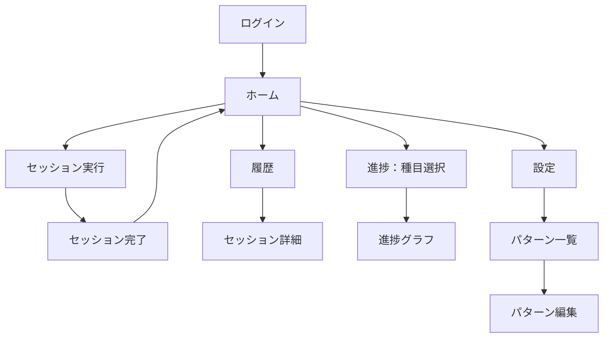

# Structure（構造層） - Gym Tracker

## 画面一覧

| 画面 | ファイル | 役割 |
|------|---------|------|
| ログイン | login_screen.dart | Google/匿名認証 |
| ホーム | home_screen.dart | パターン選択、直近セッション表示、ドラフト復帰 |
| セッション実行 | session_screen.dart | セット入力、前回値プリフィル、完了チェック |
| セッション完了 | workout_completion_screen.dart | サマリー・前回比・PR判定 |
| 履歴 | history_screen.dart | カレンダー + セッション一覧 |
| セッション詳細 | session_detail_screen.dart | セッションの種目・セット内容 |
| 進捗種目選択 | exercise_select_screen.dart | 進捗グラフ対象の種目選択 |
| 進捗グラフ | exercise_progress_screen.dart | 重量推移グラフ・1RM |
| 設定 | settings_screen.dart | アカウント情報・ログアウト |
| パターン一覧 | pattern_list_screen.dart | パターン作成・削除 |
| パターン編集 | pattern_edit_screen.dart | 種目・ターゲットセット編集 |

## 画面遷移図



## データモデル

```
Exercise
  - id: String
  - name: String
  - isBodyweight: bool    // 自重種目フラグ（進捗グラフから除外）
  - isOptional: bool

WorkoutPattern
  - id: String
  - name: String
  - exercises: List<PatternExercise>

PatternExercise（中間テーブル）
  - exerciseId: String
  - sortOrder: int
  - targetSets: List<TargetSet>

TargetSet
  - repsMin: int
  - repsMax: int

WorkoutSession
  - id: String
  - date: DateTime
  - patternId: String

SetRecord
  - id: String
  - sessionId: String
  - exerciseId: String    // patternId ではなく exerciseId に直接紐づく
  - setIndex: int
  - weight: double?       // null = 自重
  - reps: int
  - date: DateTime
  - completed: bool
```

### セッション中の状態（SessionState、永続化はドラフトのみ）

```
SessionState
  - session: WorkoutSession
  - pattern: WorkoutPattern           // 開始時のパターン（セッション中は変更しない）
  - exercises: List<Exercise>         // 今日実施する種目。pattern.exercises とインデックスで対応
  - currentExerciseIndex: int
  - setRecords: Map<exerciseId, List<SetResult>>
```

- 種目差し替え（scope #17）は `exercises[i]` のみを置き換え、`pattern` は触らない
  → 目標セットは `pattern.exercises[i].targetSets` を引き継ぐ
  → 差し替え前の種目の `setRecords` は削除する（完了画面・Firestore 保存の対象から外す）
- `setRecords` が exerciseId キーのため、同一セッション内で同じ種目は1回まで（差し替え候補から除外）

### 設計の意図

- `SetRecord` は `patternId` でなく `exerciseId` に直接紐づく
  → パターンを変更・削除しても過去の記録が壊れない
- `PatternExercise` は中間テーブルとして機能する
  → 同じ種目を複数のパターンで再利用可能

## Firestore 構造

```
users/{userId}/
  exercises/{exerciseId}
  workoutPatterns/{patternId}
  setRecords/{setRecordId}
  workoutSessions/{sessionId}
```

## 主要な状態フロー

```
authStateChangesProvider (StreamProvider)
  └── currentUserIdProvider
        ├── exerciseRepositoryProvider
        ├── workoutPatternRepositoryProvider
        ├── setRecordRepositoryProvider
        └── workoutSessionRepositoryProvider
              ├── workoutPatternsProvider
              ├── sessionInitProvider (セッション開始時)
              │     └── sessionStateProvider (セット入力の状態)
              │           └── DraftSessionService (SharedPreferences)
              └── historyProviders (月・日付・セッション詳細)
```
